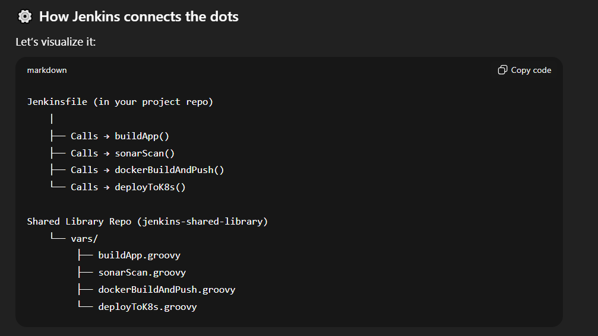
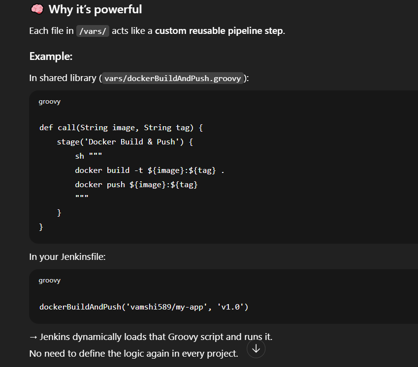

# 📂 Folder structure

jenkins-shared-library/
│
├── vars/
│   ├── buildApp.groovy
│   ├── sonarScan.groovy
│   ├── dockerBuildAndPush.groovy
│   ├── deployToK8s.groovy
│   └── notifySlack.groovy
│
├── src/org/devops/utils/
│   ├── Helper.groovy
│
└── resources/
    └── templates/


# 1️⃣ vars/buildApp.groovy

Used for Maven or Node.js build logic.
```
def call(String buildTool = 'maven') {
    stage('Build Application') {
        if (buildTool == 'maven') {
            sh 'mvn clean package -DskipTests'
        } else if (buildTool == 'npm') {
            sh 'npm install && npm run build'
        } else {
            error "Unsupported build tool: ${buildTool}"
        }
    }
}
```

# 2️⃣ vars/sonarScan.groovy

Used for SonarQube code analysis.
```
def call(String projectKey) {
    stage('SonarQube Scan') {
        withSonarQubeEnv('SonarQubeServer') {
            sh "mvn sonar:sonar -Dsonar.projectKey=${projectKey}"
        }
    }
}
```

# 3️⃣ vars/dockerBuildAndPush.groovy

Reusable function for building and pushing Docker images.

```
def call(String imageName, String tag = "latest") {
    stage('Docker Build & Push') {
        sh """
        docker build -t ${imageName}:${tag} .
        echo "$DOCKERHUB_PASS" | docker login -u "$DOCKERHUB_USER" --password-stdin
        docker push ${imageName}:${tag}
        docker logout
        """
    }
}
```

# 4️⃣ vars/deployToK8s.groovy

Reusable deployment step for Kubernetes.

```
def call(String namespace, String manifestPath = "k8s/") {
    stage('Deploy to Kubernetes') {
        sh """
        kubectl apply -f ${manifestPath} -n ${namespace}
        kubectl rollout status deployment/myapp -n ${namespace}
        """
    }
}
```

# 5️⃣ vars/notifySlack.groovy

Reusable Slack notification function.

```
def call(String message, String color = '#00FF00') {
    stage('Send Slack Notification') {
        slackSend(
            channel: '#devops-alerts',
            color: color,
            message: message
        )
    }
}
```

# 6️⃣ src/org/devops/utils/Helper.groovy

For generic reusable helper methods.

package org.devops.utils
```
class Helper {
    static String getTimestamp() {
        return new Date().format("yyyy-MM-dd HH:mm:ss")
    }
}
```

# 🧾 Example Jenkinsfile in a Microservice Repo

Now in any microservice repo, the Jenkinsfile becomes extremely short and clean 👇

```
@Library('jenkins-shared-library') _
pipeline {
    agent any

    environment {
        IMAGE = "vamshi589/${env.JOB_NAME}"
        TAG = "${env.BUILD_NUMBER}"
    }

    stages {
        stage('Checkout') {
            steps {
                git branch: 'main', url: 'https://github.com/vamshireddy903/my-java-app.git'
            }
        }

        stage('Build') {
            steps {
                buildApp('maven')
            }
        }

        stage('Sonar Scan') {
            steps {
                sonarScan('my-java-app')
            }
        }

        stage('Docker Build & Push') {
            steps {
                dockerBuildAndPush("${IMAGE}", "${TAG}")
            }
        }

        stage('Deploy') {
            steps {
                deployToK8s('production')
            }
        }
    }

    post {
        success {
            notifySlack("✅ Build #${BUILD_NUMBER} succeeded for ${JOB_NAME}")
        }
        failure {
            notifySlack("❌ Build #${BUILD_NUMBER} failed for ${JOB_NAME}", "#FF0000")
        }
    }
}
```

# ⚙️ Jenkins Setup

In Manage Jenkins → Configure System → Global Pipeline Libraries, add:

```
Field	Value  
Name	jenkins-shared-library  
Default version	main  
Retrieval method	Modern SCM  
Git repository URL	https://github.com/org/jenkins-shared-library.git  
```

# Real-World Usage Example

**In a DevOps setup:**

All teams (frontend, backend, payment-service, etc.) use the same shared library.

If you update the Docker push logic in the library → it updates for all pipelines automatically.

You can version libraries like:  
@Library('jenkins-shared-library@v2.1') _  
(useful when teams need stable versions).  

# What’s really happening when you use @Library('my-shared-lib') _

This line in your Jenkinsfile:

@Library('jenkins-shared-library') _


tells Jenkins:

“Before running this pipeline, go fetch a Shared Library named jenkins-shared-library (configured  in Jenkins global settings), load its Groovy scripts, and make them available to this pipeline.”

So — Jenkins dynamically links your Jenkinsfile ↔ shared library repo.



So when your Jenkinsfile says:

buildApp('maven')


Jenkins internally looks for:  
📄 /vars/buildApp.groovy inside the shared library  
and executes the call() method defined there.

